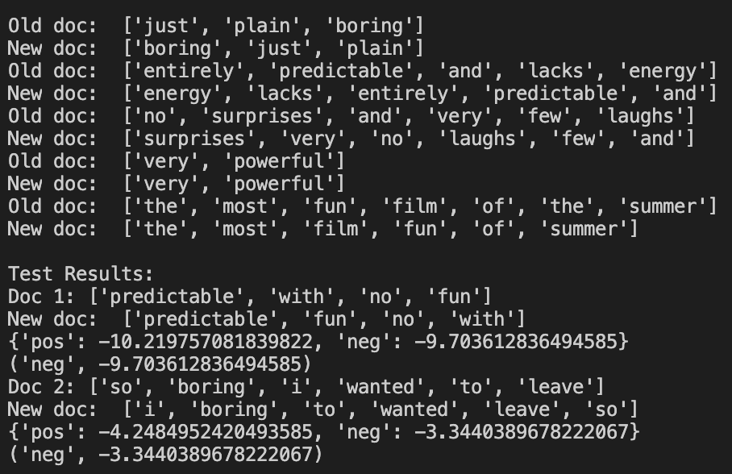

# NLP_Algorithms
NLP algorithms and projects from Jurafsky and Martin textbook

### Algorithms Implemented

#### Chapter 2
- **Minimum Edit Distance**- Wagner and Fischer (1974)

#### Chapter 4
- **Multinomial Naive Bayes Algorithm**- using logarithmic scale and add-one smoothing

- **Binary Naive Bayes Algorithm**- using logarithmic scale and add-one smoothing

Summarizing Jurafsky and Martin:

This algorithm optimizes sentiment analysis in naive Bayes text classification. For sentiment classification, whether a word happens to occur or not seems ot matter more than its frequency.

We can improve the performance of this algorithm by capping the word counts for each document at 1. For each document, we remove all duplicate words before concatenating them into a single big document (class: [all words in associated with label of class in training data]). This is labeled as the big_doc dictionary. We also remove duplicate words from each of the test documents.

{great scenes great film} --> {great scenes film}

