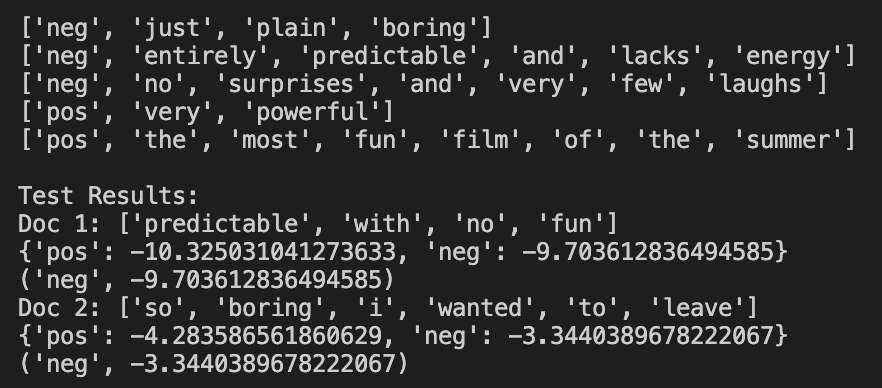

# NLP_Algorithms
NLP algorithms and projects from Jurafsky and Martin textbook

### Algorithms Implemented

#### Chapter 2
- **Minimum Edit Distance**- Wagner and Fischer (1974)

#### Chapter 4
- **Multinomial Naive Bayes Algorithm**- using logarithmic scale and add-one smoothing

